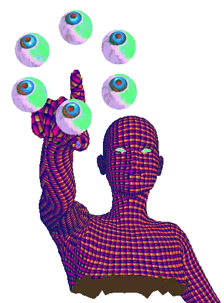
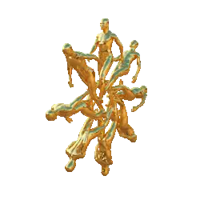
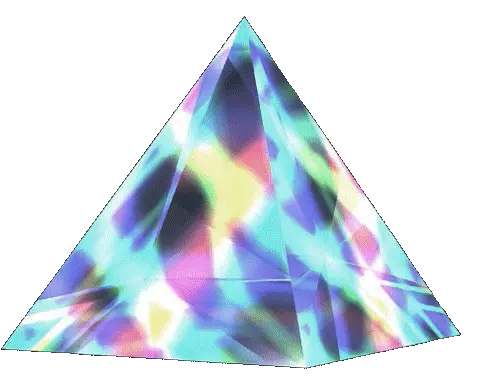

# Rascal Erratic
Ever wonder what Crypto players spend their money on the blockchain ?

## USER STORY
---
AS A Crypto god 
I WANT to be able to search for the hottest NFTs about to drop  
SO THAT I can flex on all my friends  

## Table of Contents 
------
* [Installation](#installation)

* [About](#about)

* [Authors](#authors)

## Installation
---
1. Clone repository using 'git clone"
2. Install necessary dependencies, run the following command:   
`npm install`
4. Navigate to [this link](https://cors-anywhere.herokuapp.com/corsdemo) and select   `Request temporary access to the demo server`
3. To run application `npm run develop` in the command line

## Project Showcase
---

[Link to Deployed Application](https://rascal-erratic.herokuapp.com/)

## About
---

This a project was built using the MERN Stack! 
* Node.js
* Inquirer
* MongoDB
* JavaScript
* GraphQL
* Heroku

## Authors
---
[Andy](https://github.com/superfishal)  
[Austin](https://github.com/KingAusti)  
[Jem](https://github.com/irvingjem)  
[Travis](https://github.com/ValiantThor92)  

